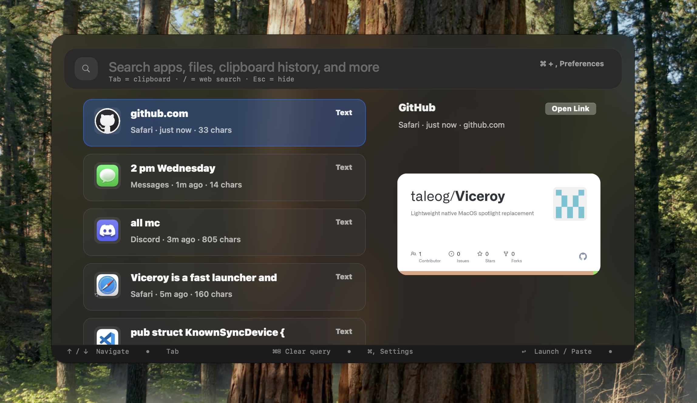
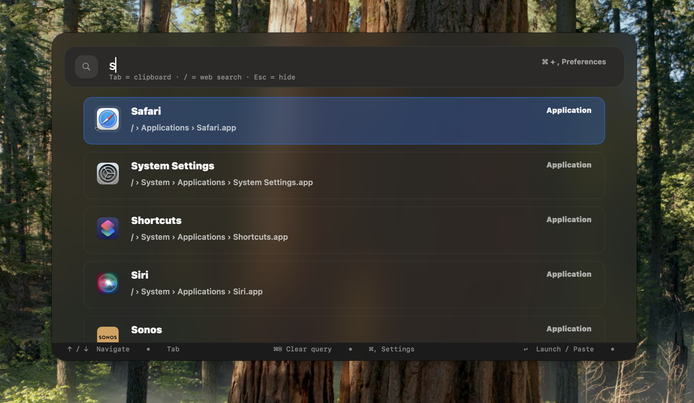

# Viceroy

[](https://github.com/taleog/Viceroy/actions/workflows/ci.yml)
[](https://github.com/taleog/Viceroy/releases)
[](LICENSE)

Viceroy is a native launcher and clipboard history tool for macOS and Windows, with optional self-hosted sync.





It combines:
- a native macOS launcher
- a Windows desktop client
- a self-hosted clipboard sync server

You can use it to search apps, files, clipboard history, system actions, emoji, dictionary shortcuts, web shortcuts, and calculator expressions from one palette.

> Status: early alpha. Expect rough edges, breaking changes, and unsigned release builds for now.

## What It Does

- Search installed apps and launch them quickly
- Search local files
- Keep searchable clipboard history for text and images
- Paste clipboard history items back into the active app
- Run built-in system commands
- Evaluate calculator expressions inline
- Search emoji and dictionary shortcuts
- Sync clipboard history between devices with a self-hosted server

## Platform Support

| Component | Status | Notes |
| --- | --- | --- |
| macOS client | Best supported | Native launcher experience |
| Windows client | Supported | Shares the Rust backend and sync support |
| Linux desktop client | Not a polished desktop target yet | CLI fallback only |
| Linux sync server | Supported | Recommended host for self-hosted sync |

## Install

### Download a release

Open the releases page:

```bash
open https://github.com/taleog/Viceroy/releases
```

Current release assets are:
- `Viceroy-macOS-<tag>.dmg`
- `Viceroy-Windows-Setup-<tag>.exe`
- `viceroy-sync-server-linux-x64-<tag>.tar.gz`
- `checksums-<tag>.txt`

Each release also includes a checksum manifest so you can verify the download before you launch it.

The builds are currently unsigned. That means:
- macOS may show a Gatekeeper warning on first launch
- Windows may show a SmartScreen warning on first launch

For step-by-step install instructions, see [`docs/installing.md`](./docs/installing.md).

### Build from source

```bash
git clone https://github.com/taleog/Viceroy.git
cd Viceroy
cargo run --bin viceroy
```

Useful shortcuts from the repo root:

```bash
make help
make app
make install-app
cargo run --bin viceroy-sync-server
```

## First Launch

On macOS, Viceroy may ask for Accessibility permission so the global hotkey and paste helpers can work correctly.

If the app does not respond to the global hotkey:
1. Open System Settings
2. Go to Privacy & Security
3. Open Accessibility
4. Allow Viceroy

If Gatekeeper warns on first launch, use right-click -> Open once.

## Using Viceroy

### Open the launcher

Use the configured global hotkey. The default is `Alt+Space`.

### Search

Type plain text to search:
- apps
- files
- clipboard entries
- system commands

Other supported patterns:
- calculator: `2 + 2`
- emoji: `:smile`
- dictionary: `define concurrency`
- web shortcuts: `google rust ffi`, `ddg tailscale`

### Clipboard history

Clipboard items are stored with metadata such as:
- source app
- timestamp
- optional custom name
- pinned state

Selecting a clipboard item can copy it back to the system clipboard and optionally paste it into the frontmost app.

### Sync

Viceroy can sync clipboard history between devices through the built-in self-hosted server.

Good starting docs:
- [`docs/sync-server.md`](./docs/sync-server.md)
- [`docs/sync-model.md`](./docs/sync-model.md)

## Configuration

Common config locations:

| Platform | Settings | Clipboard DB |
| --- | --- | --- |
| macOS | `~/Library/Application Support/viceroy/settings.json` | `~/Library/Application Support/viceroy/clipboard.db` |
| Windows | `%AppData%\\viceroy\\settings.json` | `%AppData%\\viceroy\\clipboard.db` |
| Linux | `~/.config/viceroy/settings.json` | `~/.config/viceroy/clipboard.db` |

Example `settings.json`:

```json
{
  "hotkey": "Alt+Space",
  "max_results": 50,
  "dismiss_on_escape": true,
  "dismiss_on_click_away": true,
  "sync": {
    "enabled": false,
    "device_id": "",
    "device_name": "Office Laptop",
    "server_url": "http://100.116.102.40:8787",
    "auth_token": null,
    "poll_interval_seconds": 15
  }
}
```

Notes:
- older flat sync keys are migrated automatically into the nested `sync` section
- `server_url` should be the base server URL, not an `/api/...` path
- `localhost` only works when the server runs on the same machine as the client

## Updates

Viceroy includes a background update check.

Useful flags and environment variables:
- `--no-update-check`
- `--silent-update-check`
- `VICEROY_NO_UPDATE_CHECK=1`
- `VICEROY_SILENT_UPDATE_CHECK=1`
- `VICEROY_UPDATE_METADATA_URL=<url>`

For local update-flow testing, the repo also includes:
- `make mock-server`
- `make mock-e2e`
- `scripts/mock_update_server.py`

## Development

### Quick start

```bash
git clone https://github.com/taleog/Viceroy.git
cd Viceroy
make setup
make check
make run
```

Common commands:
- `make fmt`
- `make lint`
- `make test`
- `make check`
- `make app`
- `make install-app`
- `make mock-server`
- `make mock-e2e`

See [`CONTRIBUTING.md`](./CONTRIBUTING.md) for the full contributor workflow.

## Architecture

High-level structure:
- macOS client uses Cocoa/AppKit bindings from Rust
- Windows client uses a native desktop shell built around the shared Rust backend
- the sync server stores events in SQLite and fans them out over WebSocket
- search orchestration lives in shared Rust modules and combines multiple sources in parallel

Important modules:
- `src/app_launcher.rs`
- `src/clipboard.rs`
- `src/search_engine.rs`
- `src/sync.rs`
- `src/sync_server.rs`
- `src/windows_app.rs`
- `src/ui/`

## Documentation Map

- [`docs/installing.md`](./docs/installing.md): release installs, first-run behavior, local builds
- [`docs/troubleshooting.md`](./docs/troubleshooting.md): common setup and runtime issues
- [`docs/sync-server.md`](./docs/sync-server.md): server setup and deployment
- [`docs/sync-model.md`](./docs/sync-model.md): sync invariants and conflict rules
- [`docs/issues.md`](./docs/issues.md): current limitations and debugging notes
- [`docs/roadmap.md`](./docs/roadmap.md): near-term and longer-term direction
- [`CHANGELOG.md`](./CHANGELOG.md): release history


## Contributing

Documentation, bug fixes, performance work, and platform polish are all useful contributions. Start with [`CONTRIBUTING.md`](./CONTRIBUTING.md).

## License

MIT. See [`LICENSE`](./LICENSE).
